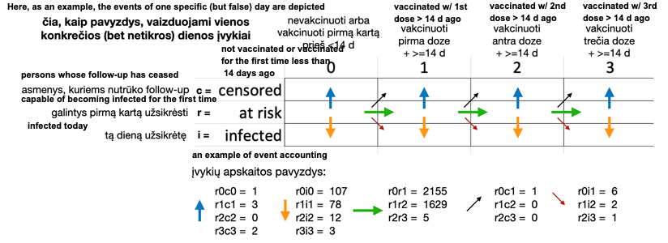
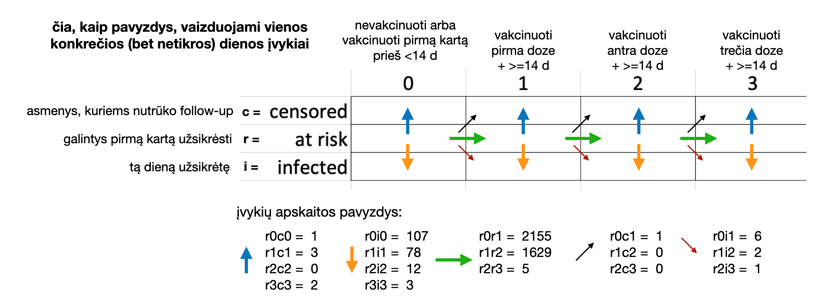

[Lithuania’s Official Statistics Portal (OSP)](https://osp.stat.gov.lt/)
issues a lot of data which
indicates transitions ("events") for individuals on each day, aggregated by
municipality (Lithuania has 60), gender and age cohort. I aggregate these
figures further to generate national data to look at how COVID-19 is now
affecting vaccinated and unvaccinated individuals.

All this comes with the caveats that I am working from OSP data but these
are my calculations and there may be errors. I am not an epidemiologist.
Straightforward presentation of case numbers have not seen much adjustment.

Further calculations (towards estimated vaccine effectiveness) may have error,
including in calculations of the unvaccinated population, which influences
the estimate of the proportional incidence in the unvaccinated population
and thus the relative incidence in vaccinated populations.

Delta has been the dominant strain of SARS-CoV2 in Lithuania since July 2021
and so some of the inflection at that point may be better attributed to
the shift of the prevalent strain rather than the base aging of the vaccinations.

## Data source

These charts are drawn using data published by the
[Official Statistics Portal](https://osp.stat.gov.lt/pradinis) (OSP)
on their [COVID-19 open data](https://experience.arcgis.com/experience/cab84dcfe0464c2a8050a78f817924ca/page/page_5/) site, along with
the
[annual population counts for Lithuanian
municipalities](https://osp.stat.gov.lt/en_GB/gyventojai1), also
published by the OSP.

```{r setup, message=FALSE, warning=FALSE}

library(vroom)
library(dplyr)
library(lubridate)
library(readxl)
library(tidyr)
library(stringr)
library(httr)
library(jsonlite)
library(ggplot2)
library(spatstat)
library(zoo)
library(scales)
library(patchwork)
library(ggrepel)

# Set-up output ----

knitr::opts_chunk$set(
	echo = FALSE,
	message = FALSE,
	warning = FALSE
)

theme_set(
  theme_minimal() +
    theme(legend.position = "bottom")
  )

# dataset source: ----

# https://open-data-ls-osp-sdg.hub.arcgis.com/datasets/1fd352a1c4534afe8ff87c564c0724c0_0/about

# dataset description: ----

# Download functions ----
download_restful <- function (api_call = "",
                              data_filter = function(x) { return(x) }) {
  if(str_length(api_call) == 0) {
    message("Empty api_call")
    return(NULL)
  }
  get_data <- GET(api_call)

  get_content <- content(get_data, "text")

  get_json <- fromJSON(get_content, flatten = TRUE)

  get_df <- as.data.frame(get_json$features)

  result_offset <- dim(get_df)
  result_offset <- result_offset[1]

  get_df <- data_filter(get_df)

  page <- 1
  done_download <- FALSE
  supp_data <- get_data

  rm("get_data", "get_content", "get_json")

  while (!done_download && supp_data$status_code == 200) {
    offset <- result_offset * page
    page <- page + 1
    supp_api_call <-
      paste(api_call, "&resultOffset=", sprintf("%d", offset), sep = "")
    supp_data <- GET(supp_api_call)
    message( ".", appendLF = FALSE)

    supp_content <- content(supp_data, "text")
    supp_json <- fromJSON(supp_content, flatten = TRUE)
    supp_df <- as.data.frame(supp_json$features) %>%
      data_filter()
    row_count <- dim(supp_json$features)
    row_count <- row_count[1]

    if (!hasName(supp_json, "exceededTransferLimit")) {
      message(
        "\nDownload complete"
      )
      done_download <- TRUE
    }
    if (supp_data$status_code == 200) {
      get_df <- rbind(get_df, supp_df)
    } else {
      message("\nDownload finished with unexpected status code",
              supp_data$status_code
      )
      break
    }
  }
  return(get_df)
}

#' Download Excel Documents
#' Taken from covidregionaldata library
#'
#' @param url Character string containing the full URL to the Excel document.
#' @param archive Character string naming the file name to assign in the
#' temporary directory.
#' @param transpose Logical, should the read in data be transposed
#' @param ... Additional parameters to pass to `read_excel()`.
#' @inheritParams message_verbose
#' @importFrom readxl read_excel
#' @return A `data.frame`.
download_excel <- function(url, archive, verbose = FALSE,
                           transpose = TRUE, ...) {
  # download
  archive <- file.path(tempdir(), archive)
  download.file(
    url = url,
    destfile = archive,
    mode = "wb", quiet = !(verbose)
  )
  # read in
  dt <- suppressMessages(
    read_excel(archive, ...)
  )

  if (transpose) {
    dt <- t(dt)
  }
  dt <- as.data.frame(dt)
  return(dt)
}

# Download the data ----

if (params$download_data) {
  lt_vacc_eff_data <- download_restful(
    api_call = "https://services3.arcgis.com/MF53hRPmwfLccHCj/arcgis/rest/services/COVID_u%C5%BEsikr%C4%97timai_tarp_vakcinuot%C5%B3_ir_nevakcinuot%C5%B3/FeatureServer/0/query?where=1%3D1&outFields=*&outSR=4326&f=json" # nolint
  ) %>%
    rename_with(~ gsub("attributes.","", .x)) %>%
    mutate(date = as_date(as_datetime(date / 1000)))


  # Download the at risk data table for the beginning of 2021
  #
  # https://ls-osp-sdg.maps.arcgis.com/sharing/rest/content/items/12822ba507864e119d713d14c1971e78/data

  initial_state <- download_excel(
    "https://ls-osp-sdg.maps.arcgis.com/sharing/rest/content/items/12822ba507864e119d713d14c1971e78/data",
    sheet = "initial_states_20210101",
    archive = "initial_states",
    transpose = FALSE)
  save(lt_vacc_eff_data, initial_state,
       file = "input_data_ongoing.Rds")
} else {
  load("input_data_ongoing.Rds")
}

# Data manipulation ----

lt_natl_ve_data <- tibble(lt_vacc_eff_data) %>%
  left_join(initial_state, by=c("municipality","sex","age_gr")) %>%
  #select(-object_id) %>%
  group_by(date, sex, age_gr) %>%
  summarise(across(matches('[icr]\\d[icr]\\d$'), ~ sum(.x, na.rm=TRUE)), r0_init = sum(at_risk)) %>%
  ungroup()

lt_natl_ve_data_adults <- tibble(lt_vacc_eff_data) %>%
  left_join(initial_state, by=c("municipality","sex","age_gr")) %>%
  #select(-object_id) %>%
  filter(age_gr != "0-19") %>%
  group_by(date, sex, age_gr) %>%
  summarise(across(matches('[icr]\\d[icr]\\d$'), ~ sum(.x, na.rm=TRUE)), r0_init = sum(at_risk)) %>%
  ungroup()

r0_init_cohorts <- tibble(initial_state) %>%
  group_by(sex, age_gr) %>%
  summarise(r0 = sum(at_risk))

r0_init <- sum(initial_state$at_risk)
r0_init_adults <- sum(initial_state %>%
                          filter(age_gr != "0-19") %>%
                        pull(at_risk))

calculate_ve <-
  function(.data) {
    #browser()
    if (dplyr::is_grouped_df(.data)) {
      return(dplyr::do(.data, calculate_ve(.)))
    }
    #message(str(.data))
  # calculate populations in each category
  mutate(.data, 
    censored = r0c0+r0c1+r1c1+r1c2+r2c2+r2c3+r3c3, # per day
    infected = r0i0+r0i1+r1i1+r1i2+r2i2+r2i3+r3i3, # per day
    r_pop_r0 = r0_init - cumsum(r0r1+r0c0+r0c1+r0i0+r0i1),
    r_pop_r1 = cumsum(r0r1-r1r2-r1i1-r1c1-r1i2-r1c2),
    r_pop_r2 = cumsum(r1r2-r2r3-r2i2-r2c2-r2i3-r2c3),
    r_pop_r3 = cumsum(r2r3-r3c3-r3i3),
) %>%
  # fractions of each population infected
  mutate(
    i_frac_r0 = (r0i0+r0i1) / r_pop_r0,
    i_frac_r1 = (r1i1+r1i2) / r_pop_r1,
    i_frac_r2 = if_else(r_pop_r2 >0, (r2i2+r2i3) / r_pop_r2, NA_real_),
    i_frac_r3 = if_else(r_pop_r3 >0,(r3i3) / r_pop_r3, NA_real_)
  ) %>%
  mutate(
    ve_vs_r0_r1 =  (i_frac_r0 - i_frac_r1)/i_frac_r0,
    ve_vs_r0_r2 = (i_frac_r0 - i_frac_r2)/i_frac_r0,
    ve_vs_r0_r3 = if_else(r_pop_r3 != 0,(i_frac_r0 - i_frac_r3)/i_frac_r0, NA_real_)
  )
}

inf_comp_wide <- calculate_ve(
  lt_natl_ve_data %>%
    #filter(date < "2021-01-15") %>%
    group_by(date) %>%
    summarise(across(matches('[icr]\\d[icr]\\d$'), ~ sum(.x, na.rm=TRUE)), r0_init=sum(r0_init)) %>%
    mutate(partially = (r1i1+r1i2) / (r0i0+r0i1+r1i1+r1i2+r2i2+r2i3+r3i3),
           fully = (r2i2+r2i3+r3i3) / (r0i0+r0i1+r1i1+r1i2+r2i2+r2i3+r3i3)) %>%
    ungroup() )
  
inf_comp_cohort_wide <- calculate_ve(
  lt_natl_ve_data %>%
    mutate(month = month(date)) %>%
    group_by(month, age_gr, sex) %>%
        summarise(across(matches('[icr]\\d[icr]\\d$'), ~ sum(.x, na.rm=TRUE)), r0_init=sum(r0_init)) %>%
    mutate(partially = (r1i1+r1i2) / (r0i0+r0i1+r1i1+r1i2+r2i2+r2i3+r3i3),
           fully = (r2i2+r2i3+r3i3) / (r0i0+r0i1+r1i1+r1i2+r2i2+r2i3+r3i3)) %>%
    ungroup()
)

# inf_comp_cohort_wide %>%
#   filter(month>=3) %>%
#   ggplot(aes(x=month, y=ve_vs_r0_r2, colour=age_gr, shape=sex)) + 
#   geom_jitter() +
#   geom_line() +
#   scale_y_continuous(limits=c(0,1), labels = scales::percent)
# 
# inf_comp_cohort_wide %>% ggplot(aes(x=month, y=ve_vs_r0_r2, colour=sex)) + geom_jitter() + facet_grid(rows=vars(age_gr))

infection_comparisons_wide <- lt_natl_ve_data %>% #filter(date < "2021-01-15") %>%
  group_by(date) %>%
  summarise(across(matches('[icr]\\d[icr]\\d$'), ~ sum(.x, na.rm=TRUE)), r0_init=sum(r0_init)) %>%
  mutate(partially = (r1i1+r1i2) / (r0i0+r0i1+r1i1+r1i2+r2i2+r2i3+r3i3),
         fully = (r2i2+r2i3) / (r0i0+r0i1+r1i1+r1i2+r2i2+r2i3+r3i3),
         boosted = (r3i3) / (r0i0+r0i1+r1i1+r1i2+r2i2+r2i3+r3i3)) %>%
  ungroup() %>%
  # calculate populations in each category
  mutate(
    censored = r0c0+r0c1+r1c1+r1c2+r2c2+r2c3+r3c3, # per day
    infected = r0i0+r0i1+r1i1+r1i2+r2i2+r2i3+r3i3, # per day
    #r_pop = r0_init - cumsum(censored + infected),
    r_pop_r0 = r0_init - cumsum(r0r1+r0c0+r0c1+r0i0+r0i1),
    r_pop_r1 = cumsum(r0r1-r1r2-r1i1-r1c1-r1i2-r1c2),
    r_pop_r2 = cumsum(r1r2-r2r3-r2i2-r2c2-r2i3-r2c3),
    r_pop_r3 = cumsum(r2r3-r3c3-r3i3)) %>%
  # fractions of each population infected
  mutate(
    i_frac_r0 = (r0i0+r0i1) / r_pop_r0,
    i_frac_r1 = (r1i1+r1i2) / r_pop_r1,
    i_frac_r2 = if_else(r_pop_r2 >0, (r2i2+r2i3) / r_pop_r2, NA_real_),
    i_frac_r3 = if_else(r_pop_r3 >0,(r3i3) / r_pop_r3, NA_real_)
  ) %>%
  mutate(
    ve_vs_r0_r1 =  (i_frac_r0 - i_frac_r1)/i_frac_r0,
    ve_vs_r0_r2 = (i_frac_r0 - i_frac_r2)/i_frac_r0,
    ve_vs_r0_r3 = if_else(r_pop_r3 != 0,(i_frac_r0 - i_frac_r3)/i_frac_r0, NA_real_)
  )

infection_comparisons_wide_adults <- lt_natl_ve_data_adults %>%
  group_by(date) %>%
  summarise(across(matches('[icr]\\d[icr]\\d$'), ~ sum(.x, na.rm=TRUE))) %>%
  mutate(partially = (r1i1+r1i2) / (r0i0+r0i1+r1i1+r1i2+r2i2+r2i3+r3i3),
         fully = (r2i2+r2i3) / (r0i0+r0i1+r1i1+r1i2+r2i2+r2i3+r3i3),
         boosted = (r3i3) / (r0i0+r0i1+r1i1+r1i2+r2i2+r2i3+r3i3)) %>%
  ungroup() %>%
  # calculate populations in each category
  mutate(
    censored = r0c0+r0c1+r1c1+r1c2+r2c2+r2c3+r3c3, # per day
    infected = r0i0+r0i1+r1i1+r1i2+r2i2+r2i3+r3i3, # per day
    #r_pop = r0_init_adults - cumsum(r0r1+r0c0+r0c1+r0i0+r0i1),
    r_pop_r0 = r0_init_adults - cumsum(r0r1+r0c0+r0c1+r0i0+r0i1),
    r_pop_r1 = cumsum(r0r1-r1r2-r1i1-r1c1-r1i2-r1c2),
    r_pop_r2 = cumsum(r1r2-r2r3-r2i2-r2c2-r2i3-r2c3),
    r_pop_r3 = cumsum(r2r3-r3c3-r3i3)) %>%
  # fractions of each population infected
  mutate(
    i_frac_r0 = (r0i0+r0i1) / r_pop_r0,
    i_frac_r1 = (r1i1+r1i2) / r_pop_r1,
    i_frac_r2 = (r2i2+r2i3) / r_pop_r2,
    i_frac_r3 = (r3i3) / r_pop_r3
  ) %>%
  mutate(
    ve_vs_r0_r1 =  (i_frac_r0 - i_frac_r1)/i_frac_r0,
    ve_vs_r0_r2 = (i_frac_r0 - i_frac_r2)/i_frac_r0,
    ve_vs_r0_r3 = if_else(r_pop_r3 != 0,(i_frac_r0 - i_frac_r3)/i_frac_r0, NA_real_)
  )

# Calculate median vaccination dates ----

median_date <- function(data, cols=c(date="date", sums="sums")) {
  sorted_data <- data %>% select(cols) %>%
    arrange(cols["date"])
  medians <- rep_len(NA_Date_, length(data[[cols["date"]]]))
  last_median_idx <- 1
  for (i in 1:length(data[[cols["date"]]])) {
    if (data[[cols["sums"]]][i]>0) {
      if (last_median_idx == 1) {
        last_median_idx <- i
        medians[i] <- data[[cols["date"]]][last_median_idx]
      } else {
        if (data[[cols["sums"]]][i] / 2 > data[[cols["sums"]]][last_median_idx] ) {
          j <- min(last_median_idx+1,i)
          while (data[[cols["sums"]]][i] / 2 > data[[cols["sums"]]][j]) {
            j <- j + 1
          }
          last_median_idx <- j - 1
        }
        medians[i] <- data[[cols["date"]]][last_median_idx]
      }
    }
  }
  return(as_date(medians))
}

narrowed_comps <- infection_comparisons_wide %>%
  mutate(fully_vxd_14d = r1r2) %>%
  select(date, fully_vxd_14d) %>%
  mutate(fully_vxd_14d_tot = cumsum(fully_vxd_14d))

median_age_calcs <- infection_comparisons_wide %>%
  mutate(med_date = median_date(data = narrowed_comps,
                                cols=c(date="date", sums="fully_vxd_14d_tot"))) %>%
  mutate(med_vxd_age
         = if_else(is.na(med_date),
                   NA_integer_,
                   # individuals are only counted into r1r2
                   # once they are 14 days beyond second dose
                   as.integer(date) - as.integer(med_date)+14L))

mean_age_values <- tibble(lt_vacc_eff_data) %>%
  select(date, r1i1_mdsv, r2i2_mdsv, r1i1_john, r2i2_john) %>%
  unique()

# Join median and mean ages and apply a delta measure ----

infection_ages <- left_join(infection_comparisons_wide, mean_age_values,
                            by=c("date")) %>%
  left_join(median_age_calcs %>%select(date, med_vxd_age), by=c("date")) %>%
  mutate(dominant_variant = 
           case_when(
             date < ymd("2021-05-20")                           ~  "alpha",
             date > ymd("2021-07-15") & date < ymd("2021-12-15") ~ "delta",
             date > ymd("2022-01-15")                            ~ "omicron"
                          )
  )

infection_comparisons <- infection_comparisons_wide %>%
  pivot_longer(
    cols = !c("date"),
    values_to = "count",
    names_to = "event")

infection_comparisons_adults <- infection_comparisons_wide_adults %>%
  pivot_longer(
    cols = !c("date"),
    values_to = "count",
    names_to = "event")
```

First consider the daily number of new cases from each population: those who
are unvaccinated or within 14 days of their first vaccination dose; those
who are between doses; and those who have had both doses of a two dose
vaccination regime.

Since September the number of "breakthrough" cases in fully-vaccinated
individuals has grown significantly and is now close to the figure for
unvaccinated individuals.

```{r cases_graph_contributions, message=FALSE, warning=FALSE}
infection_comparisons %>%
  group_by(event) %>%
  mutate(pc_cases_7d_mean = zoo::rollmean(count,k=7, fill=NA, align="center") ) %>%
  ungroup() %>%
  filter(event %in% c("r0i0", "r0i1", "r1i1", "r1i2", "r2i2", "r2i3", "r3i3")) %>%
  filter(date > ymd("2021-01-7")) %>%
  ggplot(aes(x = date, y=pc_cases_7d_mean, colour=event)) +
  theme_minimal() +
  geom_line(size=1) +
  #scale_fill_brewer(palette = "Set2") +
  scale_colour_viridis_d(name = "Individual\nvaccination\nstatus",
                         breaks = c("r0i0", "r0i1", "r1i1", "r1i2", "r2i2", "r2i3", "r3i3"),
                         labels = c("Unvaccinated or\nless than 14d\nafter 1st dose",
                                    "14d after\n1st dose",
                                    "14+d after\n1st dose",
                                    "14d after\n2nd dose",
                                    "14+d after\n2nd dose",
                                    "14d after\n3rd dose",
                                    "14+d after\n3rd dose")) +
  theme(legend.position = "bottom") +
  scale_y_continuous(sec.axis = sec_axis(~ .)) +
  labs(title="Lithuania - COVID-19 cases by vaccination status",
       subtitle="7 day rolling average",
       y="New cases",
       x="Date",
       caption="Richard Martin-Nielsen | Data: Office of Statistics Portal osp.stat.gov.lt") +
  scale_x_date()
```

Looking at the contribution to the number of cases, these cases in
fully-vaccinated individuals have increased fairly steadily since July.
The number of cases in partially-vaccinated individuals staying fairly
constant reflects that this population is staying fairly stable with
steady turnover as people complete their two dose vaccination regime.

The number of cases recorded in this dataset does not reflect re-infections.

```{r cases_graph_fractions, message=FALSE, warning=FALSE}
infection_comparisons %>%
  group_by(event) %>%
  mutate(pc_cases_7d_mean = zoo::rollmean(count,k=7, fill=NA, align="center") ) %>%
  ungroup() %>%
  filter(event %in% c("partially", "fully", "boosted")) %>%
  #filter(date > ymd("2020-11-01")) %>%
  ggplot(aes(x = date, y=pc_cases_7d_mean, colour=event)) +
  theme_minimal() +
  geom_line(size=1) +
  #scale_fill_brewer(palette = "Set2") +
  scale_colour_viridis_d(name = "Vaccination status",
                         breaks = c("partially", "fully", "boosted"),
                         labels = c("Partially", "Fully", "Boosted")) +
  theme(legend.position = "bottom") +
  scale_y_continuous( labels = scales::percent,
                      sec.axis = sec_axis(~ ., labels = scales::percent)) +
  labs(title="Lithuania - COVID-19 cases by vaccination status",
       subtitle="7 day rolling average as fraction of total first infections",
       y="New cases",
       x="Date",
       caption="Richard Martin-Nielsen | Data: Office of Statistics Portal osp.stat.gov.lt") +
  scale_x_date()
```

Normalised by the number of people with each vaccination status, incidence
peaked for unvaccinated individuals at over 1.5 in late October. The figures
for fully- and partially-vaccinated individuals increased slowly since July
and peaked a little later. There are some cases among individuals who have
had a third booster shot.

```{r cases_by_status_proportional}
infection_comparisons %>%
  group_by(event) %>%
  mutate(pc_cases_7d_mean = zoo::rollmean(count,k=7, fill=NA, align="center")*1000 ) %>%
  ungroup() %>%
  filter(event %in% c("i_frac_r0", "i_frac_r1", "i_frac_r2", "i_frac_r3")) %>%
  filter(date > ymd("2021-03-01")) %>%
  ggplot(aes(x = date, y=pc_cases_7d_mean, colour=event)) +
  theme_minimal() +
  geom_line(size=1) +
  #scale_fill_brewer(palette = "Set2") +
  scale_colour_viridis_d(name = "Vaccination status (14 days after...)",
                         breaks = c("i_frac_r0", "i_frac_r1", "i_frac_r2", "i_frac_r3"),
                         labels = c("Unvaccinated",
                                    "First dose",
                                    "Second dose",
                                    "Booster")) +
  theme(legend.position = "bottom") +
  scale_y_continuous(sec.axis = sec_axis(~ .)) +
  labs(title="Lithuania - COVID-19 cases by vaccination status",
       subtitle="7 day average cases per 1000 population with that status",
       y="New cases",
       x="Date",
       caption="Richard Martin-Nielsen | Data: Office of Statistics Portal osp.stat.gov.lt") +
  scale_x_date()
```

Vaccine effectiveness is calculated by considering the relative incidence
among each population compared with the unvaccinated population. This has
shown fairly steady decline in fully-vaccinated individuals since July and
is now below 35%.

This fading vaccination across the whole population of fully-vaccinated
individuals reflects that these vaccinations are aging. Lithuania started
vaccinating individuals in early winter 2021. The median "age" of second
dose vaccination is over 150 days (on 20 November).

```{r vaccine_effectiveness_7d, preview=TRUE}

med_age_plot <- median_age_calcs %>%
  filter(date > ymd("2021-03-01")) %>%
  ggplot(aes(x = date, y=med_vxd_age)) +
  theme_minimal() +
  geom_line(size=1) +
  scale_x_date() +
  scale_y_continuous(
    sec.axis = sec_axis(~ .,
                        breaks = seq(from = 0, to = 240, by = 30),),
    limits = c(0,NA),
    breaks = seq(from = 0, to = 240, by = 30),
    oob = scales::oob_censor)  +
  labs(x="Date", y="Median days\nsince 2nd dose")

inf_eff_plot <- infection_comparisons %>%
  group_by(event) %>%
  mutate(pc_cases_7d_mean = zoo::rollmean(count,k=7, fill=NA, align="center") ) %>%
  ungroup() %>%
  filter(event %in% c("ve_vs_r0_r1", "ve_vs_r0_r2", "ve_vs_r0_r3")) %>%
  filter(date > ymd("2021-03-01")) %>%
  filter(pc_cases_7d_mean<1) %>%
  ggplot(aes(x = date, y=pc_cases_7d_mean, colour=event)) +
  theme_minimal() +
  geom_line(size=1) +
  #scale_fill_brewer(palette = "Set2") +
  scale_colour_viridis_d(name = "Vaccination status (14 days after...)",
                         breaks = c("ve_vs_r0_r1", "ve_vs_r0_r2", "ve_vs_r0_r3"),
                         labels = c("First dose",
                                    "Second dose",
                                    "Booster")) +
  theme(legend.position = "bottom") +
  scale_y_continuous(
    sec.axis = sec_axis(
      ~ .,
      breaks = seq(from = 0, to = 1, by = 0.1),
      labels = label_percent(accuracy=1)),
    limits = c(0,1),
    breaks = seq(from = 0, to = 1, by = 0.1),
    #limits = c(0,15),
    labels = label_percent(accuracy=1),
    oob = scales::oob_censor) +
  labs(
       y="Effectiveness",
       y="Date"
) +
  scale_x_date()

inf_eff_plot / med_age_plot + plot_layout(heights = c(2,1)) +
  plot_annotation(
    title="Lithuania - COVID-19 vaccine effectiveness fades beyond 4 months",
       subtitle="Calculated on 7 day averages, compared with median days since 2nd dose",
    caption="Richard Martin-Nielsen\nData: Office of Statistics Portal osp.stat.gov.lt")
```

```{r vaccine_effectiveness_14d}

infection_comparisons %>%
  group_by(event) %>%
  mutate(pc_cases_14d_mean = zoo::rollmean(count,k=14, fill=NA, align="center") ) %>%
  ungroup() %>%
  filter(event %in% c("ve_vs_r0_r1", "ve_vs_r0_r2", "ve_vs_r0_r3")) %>%
  filter(date > ymd("2021-03-01")) %>%
  filter(pc_cases_14d_mean<1) %>%
  ggplot(aes(x = date, y=pc_cases_14d_mean, colour=event)) +
  theme_minimal() +
  geom_line(size=1) +
  #scale_fill_brewer(palette = "Set2") +
  scale_colour_viridis_d(name = "Vaccination status (14 days after...)",
                         breaks = c("ve_vs_r0_r1", "ve_vs_r0_r2", "ve_vs_r0_r3"),
                         labels = c("First dose",
                                    "Second dose",
                                    "Booster")) +
  theme(legend.position = "bottom") +
  scale_y_continuous(
    sec.axis = sec_axis(
      ~ .,
      breaks = seq(from = 0, to = 1, by = 0.1),
      labels = scales::percent),
    limits = c(0,1),
    breaks = seq(from = 0, to = 1, by = 0.1),
    #limits = c(0,15),
    labels = scales::percent,
    oob = scales::oob_censor) +
  labs(title="Lithuania - COVID-19 vaccine effectiveness by vaccination status",
       subtitle="14 day mean",
       y="Vaccine effectiveness",
       x="Date",
       caption="Richard Martin-Nielsen | Data: Office of Statistics Portal osp.stat.gov.lt") +
  scale_x_date()
```

## Comparing vaccine effectiveness to vaccine age

OSP provides for each data, the average ages of vaccinations
among those who are infected after two doses (`r1i1_mdsv` and `r2i2_mdsv`),
and I also have a rough calculation of the median age of a double vaccination.
(This calculation does not account for removing people who are infected
or "censored" from the population, nor for those who have booster shots,
so becomes less useful after November when boosters become more common.)

Both the charts using the vaccine effectiveness after a single shot show
the noisiness of this data - including some values below zero.

Based on the graph given in an OSP analysis of vaccine effectiveness
for a specific cohort^[
https://osp.stat.gov.lt/documents/10180/9098881/Pfizer_Delta_efektyvumas_20210915_v1_JB.pdf,
accessed from
https://osp.stat.gov.lt/duomenu-apzvalga-2021-09-15]
I estimate that Delta was less than 10% of infections until 20 May 2021
and more than 90% of infections after 15 July 2021. Measurements for this
date range will be excluded.

```{r ve_by_med_age_r2}
infection_ages %>%
  filter(r2i2_mdsv>0, !is.na(dominant_variant)) %>%
  mutate(med_vxd_age = med_vxd_age / 7) %>%
  ggplot(aes(colour=date,y=ve_vs_r0_r2,x=med_vxd_age,group=dominant_variant)) +
  geom_point() +
  scale_y_continuous(labels = scales::percent_format()) +
  scale_color_date(name="Date") +
  geom_smooth() +
    labs(
      title="Lithuania - COVID-19 fading vaccine effectiveness",
      subtitle = "Compared with median number of weeks since second dose",
      y="Vaccine effectiveness",
      x="Weeks since second dose (total population)",
      caption="Richard Martin-Nielsen | Data: Office of Statistics Portal osp.stat.gov.lt")
```

Breaking the data according to a split of Alpha-dominant time period
and Delta-dominant periods we see separate trends for the
two periods.

```{r ve_by_mdsv_r2}
infection_ages %>%
  filter(r2i2_mdsv>0, !is.na(dominant_variant)) %>%
  mutate( r2i2_mdsv = r2i2_mdsv / 7 ) %>%
  ggplot(aes(colour=date,y=ve_vs_r0_r2,x=r2i2_mdsv, group=dominant_variant)) +
  geom_point() +
  annotate("text", x=3,y=0.6,label="Alpha-dominant") +
  annotate("text", x=20,y=0.8,label="Delta-dominant") +
  #annotate("text", x=4.5,y=0.25,label="Lithuanian data") +
  scale_y_continuous(labels = scales::percent_format()) +
  scale_color_date(name="Date") +
  geom_smooth() +
      labs(
      title="Lithuania - COVID-19 fading vaccine effectiveness",
      subtitle = "Compared with average number of weeks since second dose",
      y="Vaccine effectiveness",
      x="Average weeks since second dose for confirmed cases",
      caption="Richard Martin-Nielsen | Data: Office of Statistics Portal osp.stat.gov.lt")
```

### Calculations for vaccine effectiveness after a single dose

These are problematic, with some figures showing negative vaccine effectiveness. I think
this is a small numbers problem where the number of cases recorded each day is quite low
and so the uncertainty of when cases 
"should" be recorded may result in very noisy data. I plan to aggregate these figures by
date of report to see if some of these problems may be resolved.


```{r ve_by_janssen_r1}
infection_ages %>%
  filter(r1i1_john>0) %>%
  mutate(r1i1_john = r1i1_john / 100) %>%
  ggplot(aes(colour=date,y=ve_vs_r0_r1,x=r1i1_john)) +
  geom_point() +
  scale_y_continuous(labels = scales::percent_format()) +
  scale_x_continuous(labels = scales::percent_format()) +
  scale_color_date(name="Date") +
  geom_smooth() +
      labs(
      title="Lithuania - COVID-19 vaccine effectiveness",
      subtitle = "Janssen vaccinations among those infected after one dose",
      y="Vaccine effectiveness",
      x="Percentage of Janssen vaccinations",
      caption="Richard Martin-Nielsen | Data: Office of Statistics Portal osp.stat.gov.lt")
```

```{r ve_by_mdsv_r1}
infection_ages %>%
  filter(r1i1_mdsv>7) %>%
  mutate( r1i1_mdsv = r1i1_mdsv / 7 ) %>%
  ggplot(aes(colour=r1i1_john,y=ve_vs_r0_r1,x=r1i1_mdsv)) +
  geom_point() +
  scale_y_continuous(labels = scales::percent_format()) +
  scale_x_continuous() +
  scale_color_continuous(name = "Percent Janssen vaccinations among infected") +
  geom_smooth() +
      labs(
      title="Lithuania - COVID-19 fading vaccine effectiveness",
      subtitle = "Compared with time since first dose",
      y="Vaccine effectiveness",
      x="Mean weeks since first dose",
      caption="Richard Martin-Nielsen | Data: Office of Statistics Portal osp.stat.gov.lt")


```

## Comparison with vaccine-specific UK results

A UK preprint^[Vaccine effectiveness and duration of protection of Comirnaty, Vaxzevria and Spikevax against mild and severe COVID-19 in the UK", by Nick Andrews, Elise Tessier, Julia Stowe, Charlotte Gower, Freja Kirsebom, Ruth Simmons, Eileen Gallagher, Meera Chand, Kevin Brown, Shamez N Ladhani, Mary Ramsay, Jamie Lopez Bernal, doi: https://doi.org/10.1101/2021.09.15.21263583] analyses vaccine effectiveness in the UK for
three vaccines against symptomatic disease, hospitalisation and death.

The UK study's approach cannot be replicated with the available open data for Lithuania,
but the overall results for vaccine effectiveness in protection from disease may be compared,
with some limitations based on the differing data available.

### Lithuanian data and approximations

For each day, Lithuania provides the mean days since vaccination
for all those fall ill more than 14 days after having
had two doses of vaccine.^[This is the `r2i2_mdsv` column.] This value varies
compared with the median number of days since vaccination for the entire vaccinated
population, which can also be calculated from available open data. This is used to
assign all of the cases for a particular day into one of the groups, approximating all
the cases by their mean.

Lithuania does not release data differentiating between cases in people vaccinated
with one vaccine or another. There is a temporal trend (individuals vaccinated earlier
are more likely to be vaccinated with Vaxzevria than Comirnaty) and there are specific
occupation-related and age-related biases, but there is no way to usefully "guess" the
vaccine make-up among cases of any particular day.

Lithuania does provide age disaggregated data so it would be possible to make
comparisons based on age cohorts but the mean days since vaccination figure is
*not* disaggregated, meaning that the mean value may mask significant variance among
age groups.

```{r binned_averages}

infn_age_bins <- infection_ages %>%
  mutate(
    r2i2_mdsv_weeks = r2i2_mdsv / 7,
    med_vxd_age_weeks = med_vxd_age / 7,
    mdsv_age_bin =
      case_when(
        r2i2_mdsv_weeks <= 1 ~ "week 1",
        r2i2_mdsv_weeks <= 9 ~ "2-9 weeks",
        r2i2_mdsv_weeks <= 14 ~ "10-14 weeks",
        r2i2_mdsv_weeks <= 19 ~ "15-19 weeks",
        TRUE ~ "20+ weeks"
      ),
    md_vxd_age_bin =
      case_when(
        med_vxd_age_weeks <= 1 ~ "week 1",
        med_vxd_age_weeks <= 9 ~ "2-9 weeks",
        med_vxd_age_weeks <= 14 ~ "10-14 weeks",
        med_vxd_age_weeks <= 19 ~ "15-19 weeks",
        TRUE ~ "20+ weeks"
      )
    ) %>%
  mutate(
    md_vxd_age_bin =
      factor(if_else(is.na(med_vxd_age), NA_character_, md_vxd_age_bin),
             c("week 1",  "2-9 weeks", "10-14 weeks", "15-19 weeks", "20+ weeks"),
             ordered=TRUE),
         mdsv_age_bin = factor(if_else(is.na(r2i2_mdsv), NA_character_, mdsv_age_bin),
             c("week 1",  "2-9 weeks", "10-14 weeks", "15-19 weeks", "20+ weeks"),
             ordered=TRUE)
         )

binned_ve_calcs_r2 <- infn_age_bins %>%
  filter(!is.na(dominant_variant), !is.na(mdsv_age_bin)) %>%
  group_by(dominant_variant,mdsv_age_bin) %>%
  summarise(mean(ve_vs_r0_r2*100), sd(ve_vs_r0_r2*100), sd(r_pop_r0)) %>%
  mutate(`Dominant strain` = str_to_title(dominant_variant), .before=dominant_variant) %>%
  rename(`Mean weeks since vaccination`=mdsv_age_bin,
         `Vaccine effectiveness [%]`=`mean(ve_vs_r0_r2 * 100)`,
         `Standard deviation [%]`=`sd(ve_vs_r0_r2 * 100)`,
         `Susceptible population standard deviation`=`sd(r_pop_r0)`) %>%
  ungroup() %>%
  select(-`dominant_variant`)

quibble <- function(x, q = c(0.05, 0.5, 0.95)) {
  tibble(x = quantile(x, q), q = q)
}
percentile_ve_calcs_r2 <- infn_age_bins %>%
  filter(!is.na(dominant_variant), !is.na(mdsv_age_bin)) %>%
  group_by(dominant_variant,mdsv_age_bin) %>%
  summarise(quibble(ve_vs_r0_r2)) %>%
  pivot_wider(id_cols=c(dominant_variant, mdsv_age_bin), values_from = c(x), names_from = c(q), names_prefix = "ci_")
pretty_percentiles <- percentile_ve_calcs_r2 %>%
  ungroup() %>%
  transmute(`Dominant strain` = str_to_title(dominant_variant),
         `Mean weeks since vaccination`=mdsv_age_bin,
         `Vaccine effectiveness [%]`=sprintf("%.1f (%.1f to %.1f)", `ci_0.5`*100, `ci_0.05`*100, `ci_0.95`*100))
  
# infn_age_bins %>% group_by(mdsv_age_bin, delta) %>%
#   count()

# library(boot)
# mean_ve <- function(formula, data, indices) {
#   d <- data[indices,] # allows boot to select sample
#   return(mean( d))
#   #return(summary(fit)$r.square)
# }
# m_ve <- function(d,w) mean(d$ve_vs_r0_r2)
# boot_ve <- boot(data=select(infn_age_bins, date, ve_vs_r0_r2,delta, r2i2_mdsv)%>%filter(r2i2_mdsv > 20,delta, !is.na(ve_vs_r0_r2)), statistic=m_ve, R=1000)
# boot.ci(boot_ve)

#knitr::kable(binned_ve_calcs_r2, digits = 2)
knitr::kable(pretty_percentiles)
```

The different trends for the two periods with Alpha- and Delta-dominance are also visible.

```{r boxplot_lt_binned_data}
infn_age_bins %>%
  filter(!is.na(dominant_variant), !is.na(mdsv_age_bin)) %>%
  mutate(dominant_variant = str_to_title(dominant_variant)) %>%
  ggplot(aes(x=mdsv_age_bin, y=ve_vs_r0_r2)) +
  scale_y_continuous(limits=c(0,1),labels = scales::percent) +
  geom_boxplot() +
  geom_jitter(alpha=0.5) +
  facet_grid(cols=vars(dominant_variant)) +
    theme(plot.caption=element_text(size = rel(0.8)),
          plot.title=element_text(size = rel(1.2)),
          axis.text.x=element_text(size = rel(0.8)) ) +
  labs(
      title="Vaccine effectiveness against COVID infection",
      subtitle = "In Alpha- and Delta-dominant periods",
      y="Vaccine effectiveness [%]",
      x="Weeks since second dose",
      caption="Data: Official Statistics Portal, Lithuania")

```

### Comparison with UK data

The UK results for vaccine effectiveness giving protection against symptomatic disease
are transcribed from Table 1 of the paper.^[Vaccine effectiveness and duration of protection of Comirnaty, Vaxzevria and Spikevax against mild and severe COVID-19 in the UK", by Nick Andrews, Elise Tessier, Julia Stowe, Charlotte Gower, Freja Kirsebom, Ruth Simmons, Eileen Gallagher, Meera Chand, Kevin Brown, Shamez N Ladhani, Mary Ramsay, Jamie Lopez Bernal, doi: https://doi.org/10.1101/2021.09.15.21263583] 

```{r comparison_with_UK}

uk_values <- read_excel("UK Paper Tables.xlsx", sheet= "Table 1") %>%
  mutate(Cohort
         = factor(Cohort,
                  c("week 1",  "2-9 weeks", "10-14 weeks", "15-19 weeks", "20+ weeks"),
                  ordered=TRUE),
         `Age group`
         = factor(`Age group`,
                  c("16+",  "16-39", "40-64", "65+"),
                  ordered=TRUE))
uk_values %>%
  mutate(Value = Value/100) %>%
  pivot_wider(id_cols = c("Vaccine", "Age group", "Cohort"),
              names_from = "Estimate",
              values_from = "Value"
              ) %>%
  ggplot(aes(x=Cohort, y=Centre, ymin=Lower, ymax=Upper)) +
  #geom_point() +
  scale_y_continuous(limits=c(0,1),labels = scales::percent) +
  geom_crossbar(size=0.2,width=0.25) +
  #geom_errorbar(mapping=aes(ymin=Lower,ymax=Upper)) +
  facet_grid(rows=vars(Vaccine), cols=vars(`Age group`)) +
  theme(plot.caption=element_text(size = rel(0.5)),
          plot.title=element_text(size = rel(1.2)),
          axis.text.x=element_text(size = rel(0.4)) ) +
  labs(
      title="Vaccine effectiveness against symptomatic disease from Delta",
      subtitle = "UK data from Nick Andrews et al.",
      y="Vaccine effectiveness [%]",
      x="Weeks since second dose",
      caption="Reproduced with data from \"Vaccine effectiveness and duration of protection of Comirnaty, Vaxzevria and Spikevax against mild and severe COVID-19 in the UK\", Table 1\nNick Andrews, Elise Tessier, Julia Stowe, Charlotte Gower, Freja Kirsebom, Ruth Simmons, Eileen Gallagher,\nMeera Chand, Kevin Brown, Shamez N Ladhani, Mary Ramsay, Jamie Lopez Bernal")
```

This gives results for four different overlapping age groups. The 16+ has the best overlap
with available Lithuanian data.

```{r uk_16_and_older}
uk_values %>%
  mutate(Value = Value/100) %>%
  filter(`Age group`=="16+") %>%
  pivot_wider(id_cols = c("Vaccine", "Age group", "Cohort"),
              names_from = "Estimate",
              values_from = "Value"
              ) %>%
  ggplot(aes(x=Cohort, y=Centre, ymin=Lower, ymax=Upper, shape=`Vaccine`)) +
  #geom_point() +
  scale_y_continuous(limits=c(0,1),labels = scales::percent) +
  geom_pointrange(size=0.5,width=0.5, position="jitter") +
  #geom_errorbar(mapping=aes(ymin=Lower,ymax=Upper)) +
  #facet_grid(rows=vars(Vaccine), cols=vars(`Age group`)) +
  theme(plot.caption=element_text(size = rel(0.5)),
          plot.title=element_text(size = rel(1.2)),
          axis.text.x=element_text(size = rel(0.8)) ) +
  labs(
      title="Vaccine effectiveness against symptomatic disease from Delta",
      subtitle = "UK data from Nick Andrews et al., all ages 16+",
      y="Vaccine effectiveness [%]",
      x="Weeks since second dose",
      caption="Reproduced with data from \"Vaccine effectiveness and duration of protection of Comirnaty, Vaxzevria and Spikevax against mild and severe COVID-19 in the UK\", Table 1\nNick Andrews, Elise Tessier, Julia Stowe, Charlotte Gower, Freja Kirsebom, Ruth Simmons, Eileen Gallagher,\nMeera Chand, Kevin Brown, Shamez N Ladhani, Mary Ramsay, Jamie Lopez Bernal")
```

Finally the comparison can be between Lithuanian data for all age groups with 
UK results for individuals 16+ using one of the two vaccines most commonly used in
Lithuania.


```{r comparison_graph_uk_lt}
uk_values %>%
  mutate(Value = Value/100) %>%
  filter(`Age group`=="16+", `Vaccine`!="Spikevax") %>%
  pivot_wider(id_cols = c("Vaccine", "Age group", "Cohort"),
              names_from = "Estimate",
              values_from = "Value"
              ) %>%
  ggplot() +
  scale_y_continuous(limits=c(0,1),labels = scales::percent) +
  geom_pointrange(mapping=aes(x=Cohort, y=Centre, ymin=Lower, ymax=Upper, shape=`Vaccine`),
                  size=0.5,width=0.5, position=position_jitter(width=0.05)) +

   geom_boxplot(data=infn_age_bins %>%
                  filter(dominant_variant=="delta", !is.na(mdsv_age_bin)),
                mapping=aes(x=mdsv_age_bin, y=ve_vs_r0_r2),colour="grey") +
  geom_jitter(data=infn_age_bins %>%
                filter(dominant_variant=="delta", !is.na(mdsv_age_bin)),
              mapping=aes(x=mdsv_age_bin, y=ve_vs_r0_r2),
              alpha=0.5,colour="grey") +
  annotate("text", x=1,y=0.55,label="Vaxzevria") +
  annotate("text", x=5,y=0.8,label="Comirnaty") +
  annotate("text", x=4.5,y=0.25,label="Lithuanian data") +
  theme(plot.caption=element_text(size = rel(0.6)),
          plot.title=element_text(size = rel(1.2)),
        plot.subtitle=element_text(size = rel(0.8)),
          axis.text.x=element_text(size = rel(1)),
        legend.position = "none") +
  labs(
      title="Vaccine effectiveness against Delta in Lithuania and the UK",
      subtitle = "UK: Comirnaty and Vaxzevria protection against symptomatic disease\nLithuania: Aggregated mix (mainly Vaxzevria & Comirnaty) against confirmed cases",
      y="Vaccine effectiveness [%]",
      x="Weeks since second dose",
      caption="UK data from \"Vaccine effectiveness and duration of protection of Comirnaty, Vaxzevria and Spikevax against mild and severe COVID-19 in the UK\", Table 1\nNick Andrews, Elise Tessier, Julia Stowe, Charlotte Gower, Freja Kirsebom, Ruth Simmons, Eileen Gallagher,\nMeera Chand, Kevin Brown, Shamez N Ladhani, Mary Ramsay, Jamie Lopez Bernal\nLithuania data from the Official Statistics Portal")

```

### Comments on the comparison


Lithuania did not (unlike the UK and Canada) extend the spacing between first and second
doses of Vaxzevria or other vaccines so even if the data were available to differentiate
vaccine effectiveness for the different vaccines in use, the resulting effectiveness
in Lithuania probably differs because of this difference in how the same vaccines were
administered.

Lithuanian figures all fall between the UK's vaccine-specific values
for the two vaccines
in use, reflecting the mix of vaccines in use in the Lithuanian population (and that this
mix is masked by aggregation of the open data available). Vaxzevria was used much more
earlier in 2021 than Comirnaty, meaning that "older" vaccinations are more likely to
be with Vaxzevria, which may explain why the Lithuanian data for 20+ weeks
are closer to the the UK Vaxzevria values than the Comirnaty value.

Lithuania's vaccination rate for under 18 is very low (and zero below 12). It is not
clear whether this comparison would be improved by excluding all Lithuanians under 20.


## Calculations excluding under-20s

Because the level rate of vaccination among Lithuanians below the age of 20 is
much lower than in the rest of the population, I also present calculations which
only consider the population of 20 and above.

First, here is a chart from the OSP showing the vaccination status by age
group.


`r paste0(", "%Y%m%d"),".png){.external}")`

The vaccine is not available for
children under the age of 11, and though figures for 18 and 19 year-olds are
comparable with older adults, the data for vaccination and infection/censoring
are only available on 20 year increments.

```{r cases_graph_fractions_adults, message=FALSE, warning=FALSE}
infection_comparisons_adults %>%
  group_by(event) %>%
  mutate(pc_cases_7d_mean = zoo::rollmean(count,k=7, fill=NA, align="center") ) %>%
  ungroup() %>%
  filter(event %in% c("partially", "fully", "boosted")) %>%
  #filter(date > ymd("2020-11-01")) %>%
  ggplot(aes(x = date, y=pc_cases_7d_mean, colour=event)) +
  theme_minimal() +
  geom_line(size=1) +
  #scale_fill_brewer(palette = "Set2") +
  scale_colour_viridis_d(name = "Vaccination status",
                         breaks = c("partially", "fully", "boosted"),
                         labels = c("Partially", "Fully", "Boosted")) +
  theme(legend.position = "bottom") +
  scale_y_continuous( labels = scales::percent,
                      sec.axis = sec_axis(~ ., labels = scales::percent)) +
  labs(title="Lithuania - COVID-19 cases by vaccination status - 20+ only",
       subtitle="7 day rolling average as fraction of total first infections",
       y="New cases",
       x="Date",
       caption="Richard Martin-Nielsen | Data: Office of Statistics Portal osp.stat.gov.lt") +
  scale_x_date()
```

```{r cases_by_status_proportional_adults}
infection_comparisons_adults %>%
  group_by(event) %>%
  mutate(pc_cases_7d_mean = zoo::rollmean(count,k=7, fill=NA, align="center")*1000 ) %>%
  ungroup() %>%
  filter(event %in% c("i_frac_r0", "i_frac_r1", "i_frac_r2", "i_frac_r3")) %>%
  filter(date > ymd("2021-03-01")) %>%
  ggplot(aes(x = date, y=pc_cases_7d_mean, colour=event)) +
  theme_minimal() +
  geom_line(size=1) +
  #scale_fill_brewer(palette = "Set2") +
  scale_colour_viridis_d(name = "Vaccination status (14 days after...)",
                         breaks = c("i_frac_r0", "i_frac_r1", "i_frac_r2", "i_frac_r3"),
                         labels = c("Unvaccinated",
                                    "First dose",
                                    "Second dose",
                                    "Booster")) +
  theme(legend.position = "bottom") +
  scale_y_continuous(sec.axis = sec_axis(~ .)) +
  labs(title="Lithuania - COVID-19 cases by vaccination status, 20+ only",
       subtitle="7 day average cases per 1000 population with that status",
       y="New cases",
       x="Date",
       caption="Richard Martin-Nielsen | Data: Office of Statistics Portal osp.stat.gov.lt") +
  scale_x_date()
```

```{r vaccine_effectiveness_7d_adults, fig.height=6, fig.width=6}

inf_eff_plot_adults <- infection_comparisons_adults %>%
  group_by(event) %>%
  mutate(pc_cases_7d_mean = zoo::rollmean(count,k=7, fill=NA, align="center") ) %>%
  ungroup() %>%
  filter(event %in% c("ve_vs_r0_r1", "ve_vs_r0_r2", "ve_vs_r0_r3")) %>%
  filter(date > ymd("2021-03-01")) %>%
  filter(pc_cases_7d_mean<1) %>%
  ggplot(aes(x = date, y=pc_cases_7d_mean, colour=event)) +
  theme_minimal() +
  geom_line(size=1) +
  #scale_fill_brewer(palette = "Set2") +
  scale_colour_viridis_d(name = "Vaccination status (14 days after...)",
                         breaks = c("ve_vs_r0_r1", "ve_vs_r0_r2", "ve_vs_r0_r3"),
                         labels = c("First dose",
                                    "Second dose",
                                    "Booster")) +
  theme(legend.position = "bottom") +
  scale_y_continuous(
    sec.axis = sec_axis(
      ~ .,
      breaks = seq(from = 0, to = 1, by = 0.1),
      labels = label_percent(accuracy=1)),
    limits = c(0,1),
    breaks = seq(from = 0, to = 1, by = 0.1),
    #limits = c(0,15),
    labels = label_percent(accuracy=1),
    oob = scales::oob_censor) +
  labs(
       y="Effectiveness",
       y="Date"
) +
  scale_x_date()

inf_eff_plot_adults / med_age_plot + plot_layout(heights = c(2,1)) +
  plot_annotation(
    title="Lithuania - COVID-19 vaccine effectiveness fades beyond 4 months",
       subtitle="Calculated on 7 day averages, ages 20+, compared with median days since 2nd dose",
    caption="Richard Martin-Nielsen\nData: Office of Statistics Portal osp.stat.gov.lt")

```

## Dataset description (English translation) {.appendix}

*google translation of original Lithuanian*^[https://open-data-ls-osp-sdg.hub.arcgis.com/datasets/1fd352a1c4534afe8ff87c564c0724c0_0/about]

The table is intended for monitoring the incidence of infections in four groups of the Lithuanian population: unvaccinated and those who received one / two / three doses of vaccine. The columns in the table describe how many events of each type occurred on a particular day. A total of 17 events are described. Events can only happen to Lithuanian residents who have never been infected before. Event tracking begins on January 1, 2021. The table is aggregated by date, municipality (60 units), gender (2 units), age group (8 units), so each row describes the number of events that occurred on a specific date for a specific age-specific population in a particular municipality.

An integral part of this table is the auxiliary table "Initial conditions, on 01.01.2021", which describes the number of persons who may become infected at the beginning of 2021-01-01. Only with these two tables is it possible to calculate the frequency of infections (normalized daily number of infections) per day from which preliminary conclusions on the efficacy of vaccines can be drawn.


Column description:

|field|description|
|-----|-----|
|  date |is the day of 2021 on which the events described in the following columns occurred|
|municipality | the municipality of the declared place of residence, describing the group of persons participating in the events|
|sex | gender describing the group of persons involved in the events: V = men, M = women|
|age_gr | an age category that describes the group of people participating in the events|
|r0i0 | unvaccinated * who became infected for the first time (event - first infection)|
|r0r1 | unvaccinated * who have been vaccinated (event - vaccination)|
|r0c0 | unvaccinated * who fell out of the risk of infection ("censored" persons, statistical term, **)|
|r0i1 | unvaccinated * who have been vaccinated and become infected for the first time|
|r0c1 | unvaccinated * who have been vaccinated and are at risk of becoming infected|
|r1i1 | 1 dose vaccinated * who became infected for the first time|
|r1r2 | 1 dose vaccinated * who became vaccinated with the second dose|
|r1c1 | 1 dose vaccinated * who were at risk of infection ("censored" persons, statistical term, **)|
|r1i2 | 1 dose vaccine * who became vaccinated with a second dose and became infected for the first time|
|r1c2 | 1 dose vaccine * who became vaccinated with the second dose and were at risk of infection|
|r2i2 | 2 doses to be vaccinated * who became infected for the first time|
|r2r3 | 2 doses to be vaccinated *, which became the third dose|
|r2c2 | 2 doses to be vaccinated * who fell out of the risk of infection ("censored" persons, statistical term, **)|
|r2i3 | 2 doses *, which became the third dose and became infected for the first time|
|r2c3 | 2 doses * that became the third dose and fell out of the risk of infection|
|r3i3 | 3 doses to be vaccinated * who became infected for the first time|
|r3c3 | 3 doses to be vaccinated * who fell out of the risk of infection ("censored" persons, statistical term, ***)|
|r1i1_mdsv | average number of days since the first vaccination in the r1i1 group (***)|
|r2i2_mdsv | average number of days since the second vaccination in the r2i2 group (***)|
|r1i1_john | percentage of Janssen vaccine recipients in the r1i1 group (***)|
|r2i2_john | percentage of vaccinated Janssen vaccine (as first dose) in the r2i2 group (***)|


Column naming logic:

* first pair of two characters (eg "r1") - what state the persons "leave" during the described event
* second pair of two characters (eg "i2") - what state persons "enter" during the described event

|first character of the character pair (letter)||
|------|-------|
|  r | 'at risk'; people who may become infected (i.e., this has not happened before)|
|i | 'infected'; persons who are infected (first positive diagnostic test)|
|c | 'censored'; persons who are not and cannot be infected (**)|

|second character of the character pair (number)||
|------|-------|
|  0 | persons who have not yet been vaccinated on a given day or have been vaccinated very recently (<in the course of 14 days) *|
|  1 | persons who have already been vaccinated on a given day 14 days after the first dose or who have received a second dose very recently (<in the course of 14 days) *|
|  2 | persons who have been vaccinated for 14 days on a given day since the second dose or who have received a third dose very recently (<14 days) *|
|  3 | persons who have already 14 days since the third dose of the vaccine on a given day *|




Footnotes:

\* The effect of the vaccine is considered to start on day 14 from the actual date of vaccination, so in this table describing the effectiveness of the vaccines, the person is considered unvaccinated on the actual day of the first vaccination (as well as on the thirteenth day after the first vaccination). The same principle applies to the second and third doses of the vaccine: they take effect on the 14th day after the actual date of the vaccination.
  
 ** unsupervised persons (without 'follow-up', 'censored'), e.g. due to emigration, lost contact, death, etc.
 
*** calculated for all municipalities, all genders, all age groups in total (for confidentiality)

## Dataset description (Lithuanian original) {.appendix}

Lentelė yra skirta užsikrėtimų dažniams stebėti keturiose Lietuvos gyventojų grupėse: neskiepytųjų bei skiepytųjų viena/dviem/trim vakcinos dozėmis. Lentelės stulpeliai aprašo, kiek kiekvienos rūšies įvykių įvyko konkrečią dieną. Iš viso yra aprašoma 17 įvykių. Įvykiai gali įvykti tik su iki tol dar niekada neužsikrėtusiais Lietuvos gyventojais. Įvykių stebėjimas prasideda nuo 2021 metų sausio 1 dienos. Lentelė yra agreguota pagal datą, savivaldybę (60 vnt), lytį (2 vnt), amžiaus grupę (8 vnt), tad kiekviena eilutė aprašo įvykių skaičių, kuris nutiko konkrečią datą konkrečios savivaldybės konkrečios lyties konkrečios amžiaus grupės gyventojams.

Šios lentelės neatsiejama dalis yra pagalbinė lentelė "Pradinės būsenos, 2021-01-01 dieną", kuri aprašo asmenų, galinčių užsikrėsti skaičių 2021-01-01 dienos pradžioje. Tik turint šias abi lenteles įmanoma suskaičiuoti užsikrėtimų dažnį (normalizuotą dieninį užsikrėtimų skaičių) padieniui, iš kurio galima daryti preliminarias išvadas apie vakcinų efektyvumą.


Stulpelių aprašymas:

|field|description|
|-----|-----|
|  date | 2021 metų diena, kurios metu įvyko tolimesniuose stulpeliuose aprašomi įvykiai|
|municipality | deklaruotos gyvenamosios vietos savivaldybė, aprašanti įvykiuose dalyvaujančių asmenų grupę|
|sex | lytis, aprašanti įvykiuose dalyvaujančių asmenų grupę: V = vyrai, M = moterys|
|age_gr | amžiaus kategorija, aprašanti įvykiuose dalyvaujančių asmenų grupę|
|r0i0 | neskiepyti*, kurie pirmą kartą tapo užsikrėtusiais (įvykis - pirmas užsikrėtimas)|
|r0r1 | neskiepyti*, kurie tapo paskiepytais (įvykis - paskiepijimas)|
|r0c0 | neskiepyti*, kurie iškrito iš rizikos užsikrėsti ("cenzūruoti" asmenys, statistikos terminas, **)|
|r0i1 | neskiepyti*, kurie tapo paskiepytais ir pirmą kartą tapo užsikrėtusiais|
|r0c1 | neskiepyti*, kurie tapo paskiepytais ir iškrito iš rizikos užsikrėsti|
|r1i1 | 1 doze skiepyti*, kurie pirmą kartą tapo užsikrėtusiais|
|r1r2 | 1 doze skiepyti*, kurie tapo paskiepytais antra doze|
|r1c1 | 1 doze skiepyti*, kurie iškrito iš rizikos užsikrėsti ("cenzūruoti" asmenys, statistikos terminas, **)|
|r1i2 | 1 doze skiepyti*, kurie tapo paskiepytais antra doze ir pirmą kartą tapo užsikrėtusiais|
|r1c2 | 1 doze skiepyti*, kurie tapo paskiepytais antra doze ir iškrito iš rizikos užsikrėsti|
|r2i2 | 2 dozėm skiepyti*, kurie pirmą kartą tapo užsikrėtusiais|
|r2r3 | 2 dozėm skiepyti*, kurie tapo paskiepytais trečia doze|
|r2c2 | 2 dozėm skiepyti*, kurie iškrito iš rizikos užsikrėsti ("cenzūruoti" asmenys, statistikos terminas, **)|
|r2i3 | 2 dozėm skiepyti*, kurie tapo paskiepytais trečia doze ir pirmą kartą tapo užsikrėtusiais|
|r2c3 | 2 dozėm skiepyti*, kurie tapo paskiepytais trečia doze ir iškrito iš rizikos užsikrėsti|
|r3i3 | 3 dozėm skiepyti*, kurie pirmą kartą tapo užsikrėtusiais|
|r3c3 | 3 dozėm skiepyti*, kurie iškrito iš rizikos užsikrėsti ("cenzūruoti" asmenys, statistikos terminas, ***)|
|r1i1_mdsv | vidutinis dienų skaičius praėjęs nuo pirmo skiepo r1i1 asmenų grupėje (***)|
|r2i2_mdsv | vidutinis dienų skaičius praėjęs nuo antro skiepo r2i2 asmenų grupėje (***)|
|r1i1_john | vakcinuotųjų "Janssen" vakcina procentas r1i1 asmenų grupėje (***)|
|r2i2_john | vakcinuotųjų "Janssen" vakcina (kaip pirma doze) procentas r2i2 asmenų grupėje (***)|


Stulpelių pavadinimo sudarymo logika:

*  pirma dviejų simbolių pora (pvz "r1") - iš kokios būsenos asmenys "išeina" aprašomo įvykio metu
* antra dviejų simbolių pora (pvz "i2") - į kokią būseną asmenys "įeina" aprašomo įvykio metu

|pirmas simbolių poros simbolis (raidė):||
|----------|-------|
|  r | 'at risk'; asmenys, kurie gali užsikrėsti (t.y., tai dar neatsitiko anksčiau)|
|i | 'infected'; asmenys, kurie yra užsikrėtę (pirmas teigiamas diagnostinis testas)|
|c | 'censored'; asmenys, kurie nėra užsikrėtę ir negali užsikrėsti (**)|

|antras simbolių poros simbolis (skaičius):||
|--------|-----------|
|  0 |asmenys, kurie konkrečią dieną dar yra neskiepyti arba yra paskiepyti labai neseniai (<14 d. eigoje) *|
|  1 | asmenys, kuriems konkrečią dieną nuo pirmos skiepo dozės jau yra praėję 14 dienų, arba jie yra paskiepyti antra doze labai neseniai (<14 d. eigoje) *|
|  2 | asmenys, kuriems konkrečią dieną nuo antros skiepo dozės jau yra praėję 14 dienų, arba jie yra paskiepyti trečia doze labai neseniai (<14 d. eigoje) *|
|  3 | asmenys, kuriems konkrečią dieną nuo trečios skiepo dozės jau yra praėję 14 dienų *|


Detali lentelės turinio paaiškinimo logika iliustracijoje:



Išnašos:

  \* laikoma, kad vakcinos efektas prasideda 14-ą dieną nuo faktinės skiepijimo datos, tad šioje lentelėje, aprašančioje vakcinų efektyvumą, asmuo faktinę pirmo skiepo dieną (o taip pat ir tryliktą dieną po pirmo skiepo) yra laikomas nevakcinuotu. Toks pat principas taikomas ir antrai bei trečiai skiepo dozėms: jos įsigalioja 14-ą dieną nuo faktinės skiepijimo datos.
  
\** nebestebimi asmenys (be 'follow-up', 'censored'), pvz. dėl emigracijos, prarasto kontakto, mirties ir pan.

\*** apskaičiuota visoms savivaldybėms, visom lytims, visoms amžiaus grupėms bendrai (dėl konfidencialumo)